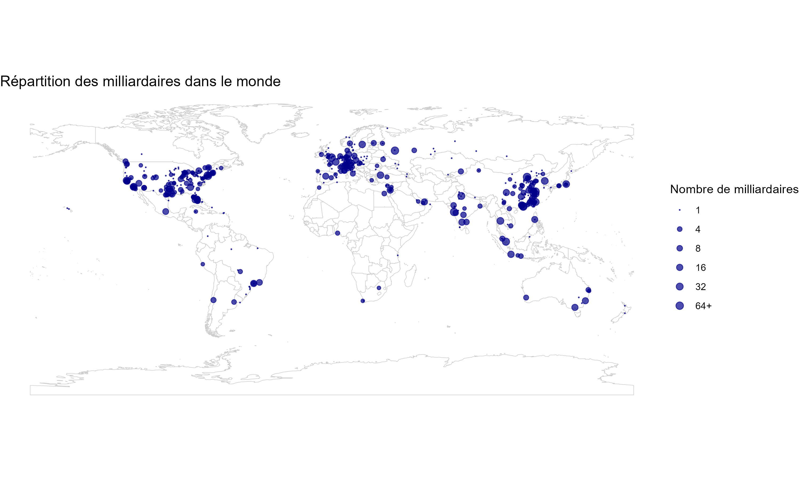
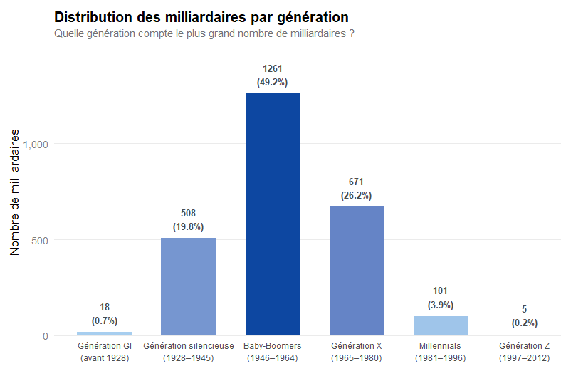

```{r, include=FALSE}
library(tidyr)
library(maps)
library(ggplot2) 
library(dplyr) 
library(readr)
library(ggrepel)
library(stringr)
library(sf)
library(rnaturalearthdata)
library(countrycode)
library(stringi)
library(here)
library(scales)

df <- read_csv(here("data", "Billionaires_Statistics_Dataset.csv"))
```
# **Introduction**

## Données

Le [dataset](https://www.kaggle.com/datasets/nelgiriyewithana/billionaires-statistics-dataset/) utilisé par notre groupe contient des données sur les milliardaires à travers le monde contenant 2540 observations et un total de 35 variables.

Ce dataset provient de [Nidula Elgiriyewithana](https://www.linkedin.com/in/nidula/), un ingénieur chercheur en IA et regroupe un ensemble d'informations sur les milliardaires.

La structure du dataset est le suivant :

-   Le classement du milliardaire (rank)
-   Le montant de sa fortune (finalWorth)
-   Le secteur économique dans lequel le milliardaire opère (category, industries)
-   Les informations personnelles du milliardaire (personName, age, country, state, city, countryOfCitizenship, gender, birthDate, ...)
-   L'entreprise à l'origine de leur fortune ou le domaine spécifique à l'origine de la fortune (source)
-   Le nom de l'organisme ou entreprise affiliée actuellement à ces milliardaires (organization)
-   Un indicateur si le milliardaire a produit ou hérité de sa fortune (selfMade, status)
-   L'indice des prix à la consommation (2010 base 100) du pays dans lequel ce milliardaire vit en 2019 (cpi_country)
-   L'inflation des prix en pourcentage entre le début et la fin de l'année 2019 dans lequel ce millionaire vit (cpi_country_change)
-   Le PIB du pays dans lequel ce milliardaire vit (gdp_country)
-   Des informations sur le taux d'éducation dans le primaire et le supérieur du pays dans lequel ce milliardaire vit (gross_tertiary_education_enrollment, gross_primary_education_enrollment_country)
-   L'espérance de vie (life_expectancy_country)
-   Le taux de recettes fiscales en pourcentage du PIB (tax_revenue_country_country)
-   Le taux d'imposition sur les entreprises en pourcentage des bénéfices commerciaux (total_tax_rate_country)
-   La population du pays dans lequel le milliardaire réside (population_country)

Cependant, certaines variables se recoupent. En effet, personName, qui inclut le nom et le prénom, se retrouve dans lastName (nom) et firstName (prénom). La date d'anniversaire entière du milliardaire (birthDate), qui est présente, est divisée aussi dans les données par birthYear, birthMonth et birthDay. Le pays où habite le milliardaire est présent (country), mais, on trouve aussi les coordonnées du pays d'origine du pays (latitude_country,longitude_country). Les variables category et industries sont redondantes.

Ce dataset est composé, pour les variables pertinentes, de données : discrètes, continues et nominale.

Nous avons choisi ce dataset car :

-   Il est complet et toutes les informations nécessaires pour répondre à nos questions y figurent.
-   Nous avons la volonté et la curiosité d'en apprendre plus sur les milliardaires comme la provenance de leur richesse et leur répartition dans le monde nous intéresse.
-   Avec cette large quantitée d'informations variées, il est possible d'obtenir des réponses plus ou moins pertinentes sur des questions qu'on pourrait tous se poser et d'en tirer des conclusions générales d'un point de vue sociologique. (proportions d'hommes/femmes, gagnée par l'héritage ou le travail, etc.)

Notre travail s'articule autour de cette question : Quels facteurs expliquent l'émergence et la concentration des milliardaires?

# **Analyse exploratoire**
## I. Géographie de la richesse mondiale
Les milliardaires ont la possibilité de s’établir où ils le souhaitent en raison de leur revenu. Cependant, le choix de leur résidence n’est pas laissé au hasard. Il peut supposer qu’ils habitent dans des lieux où ils peuvent facilement avoir des opportunités entrepreneuriales, un accès aux meilleures écoles pour leur famille et proche des centres de décisions de leur(s) entreprise(s). Il semble logique que les opportunités de faire croître leur entreprises se trouvent majoritairement dans l’hémisphère nord. Il convient donc de se demander où les milliardaires se concentrent dans le monde. 
Problématique de la partie: Où se concentrent les milliardaires dans le monde? 

Q1 - Quelles villes comptent le plus de milliardaires ?
<details>

<summary>Question et problème étudié</summary>
L'objectif est de voir où vivent les milliardaires. On suppose qu'ils vivent dans des mégalopoles dans l'hémisphère Nord où il y a des opportunités économiques intéressantes. On peut penser à new York, Los Angeles, Hong Kong, Londres mais aussi des villes en Chine et d'autres réprésentatives de certains industries iconiques.

</details>
<details>

<summary>Visualisation</summary>
```{r, echo=FALSE}
#Selection des 20 villes les plus peuplées
cities_top_20 <- df%>% filter(!is.na(city)) %>% count(city, sort = TRUE) %>% slice_head(n = 20)

#Diagramme à barre horizontale
data_cities <- ggplot(cities_top_20, aes(x=reorder(city,n), y=n)) + geom_col() + coord_flip() +
  labs(title = "Top 20 des villes avec le plus de milliardaires",
       x = "Ville",
       y = "Nombre de milliardaires")
data_cities
```
Mon choix s'est porté sur un diagramme à barre qui est bien pour montrer une répartition. J'ai choisi de montrer les 20 villes concentrant le plus de milliardaires pour soucis de lisibilité et de pertinence. 
</details>

<details>
<summary>Interprétation et réponse</summary>
La représentation répond à la question. L'hypothèse de départ est vérifiée. New York est en tête de loin et cela peut s'expliquer car la ville concentre énormément d'industries et donc d'opportunités.
</details>


Q3 - Comment se répartissent les milliardaires dans les états américains ?

<details>

<summary>Question et problème étudié</summary>

Les États-Unis sont un grand pays qui concentrent des milliardaires. Cependant, la répartition de la population dans ce pays est inégale donc on suppose que les milliardaires se concentrent dans les grandes villes qui sont dans les états qui concentrent la population (Californie, New York, ...). Les états ruraux comptent pas ou peu de milliardaires en comparaison (Wyoming, ...). L'objectif de cette data visualisation est de vérifier cette hypothèse.

</details>

<details>

<summary>Visualisation</summary>
```{r, echo=FALSE}
american_billionaires <- df %>% 
  filter(country =="United States", !is.na(state)) %>%
  count(state, sort = TRUE) %>% 
  mutate(state = tolower(state), number_of_billionaires = n) %>% 
  select(state, number_of_billionaires)

states_map <- map_data("state")

american_billionaires_map_data <- merge(states_map, american_billionaires, by.x = "region", by.y ="state", all.x = TRUE) %>% mutate(number_of_billionaires = replace_na(number_of_billionaires, 0))

american_billionaires_map <- american_billionaires_map_data %>% ggplot(aes(map_id= region,fill = number_of_billionaires)) +
    geom_map(map = states_map, colour = "black") +
    expand_limits(x = states_map$long, y = states_map$lat) +
    coord_map("polyconic") +
  scale_fill_viridis_c()+
  labs(title="Répartition des milliardaires dans les états américains", x="Longitude", y="Latitude", fill="Nombre de milliardaires" )
american_billionaires_map
```
On a choisi de représenter cela avec une carte pour rendre cela visuel, pour avoir l'information qui accroche le regard. Par ailleurs, représenter cela avec un diagramme à barre, qui convient tout à fait, nous aurait fait perdre de la données car représenter 42 données en abscisse prend de la place. La carte est mieux pour représenter l'ensemble de données.

</details>

<details>
<summary>Interprétation et réponse</summary>
Les états les plus peuplés concentrent le plus de milliardaires : Californie, Texas, Floride et New York. Ce sont les états qui concentrent des villes importantes : Los Angeles, New York, Austin, Dallas, Miami, ... D'autant plus que la Silicon Valley, épicentre des entreprises de la tech américains, se trouvent en Californie, ce qui explique qu'elle compte plus de 150 milliardaires. 
Sans surprise, les autres états comptent entre 0 et 50 milliardaires. 
La visualisation répond à la question. 

</details>


Q8 - Où sont répartis les milliardaires dans le monde ?
<details>
<summary>Question et problème étudié</summary>

On cherche à comprendre la répartition géographique des milliardaires afin de voir si elle est concentrée dans certains pays ou régions du monde.
On s’attend à ce que les milliardaires soient fortement concentrés dans les pays les plus riches et économiquement développés, notamment les États-Unis, la Chine, l’Allemagne, la France et le Royaume-Uni. 
Ces pays offrent des écosystèmes favorables à la création de richesse, avec des marchés financiers matures, des infrastructures solides et des opportunités d’affaires.

</details>

<details>
<summary>Visualisation</summary>

Pour cette analyse, il est pertinent d’utiliser une carte du monde avec des cercles proportionnels à la concentration de milliardaires dans chaque ville. 
Cela permet de visualiser rapidement les zones de forte concentration et de comparer les pays entre eux.


```{r stats, echo=FALSE}
```

</details>

<details>
<summary>Interprétation et réponse</summary>

Les données confirment globalement nos hypothèses. En majorité, on retrouve les milliardaires dans les pays les plus riches et économiquement développés, que ce soit aux États-Unis, en Chine et en Europe de l’Ouest.
Cependant, on observe aussi des concentrations significatives dans des pays émergents comme l’Inde, qui a vu une croissance économique rapide ces dernières années, créant ainsi de nouvelles opportunités pour la création de richesse. 

</details>

Q9 - Quelle est la nationalité la plus représentée parmi les milliardaires ?


Q19 - Quel est le nombre de milliardaires par habitant dans chaque pays ?
```{r, echo=FALSE}
q11 <- df %>%
  group_by(country, population_country) %>%
  summarise(nb = n(), .groups = "drop") %>%
  filter(!is.na(population_country), population_country > 0) %>%
  mutate(par_million = nb / (population_country / 1e6)) %>%
  arrange(desc(par_million)) %>%
  head(20)

p11 <- ggplot(q11, aes(x = reorder(country, par_million), y = par_million)) +
  geom_col(fill = "#756bb1") +
  coord_flip() +
  labs(
    title = "Milliardaires par million d'habitants",
    subtitle = "Top 20 des pays (2023)",
    x = NULL,
    y = "Milliardaires par million d'habitants"
  ) +
  theme_minimal(base_size = 13)
p11
```
Q25 - Y a-t-il des mouvements de milliardaires entre leur nationalité et leur lieu d'habitation dans le monde ? 
<details>
<summary>Question et problème étudié </summary>
On part du constat que les milliardaires ont la possibilité de bouger et d'habiter des endroits plus favorables au développement de leur business. Cependant, certains ont pu naitre dans des pays peu propices à ce développement. Ainsi, on peut supposer que pour certains profils, il y a une différence entre la nationalité (d'origine, naissance) et leur lieu d'habitation. On propose une vue statique de ces mouvements sur l'année 2023.
</details>

<details>
<summary> Visualisation </summary>
Le diagramme est dans le Shiny app. 
</details>

<details>
<summary> Interprétation et réponse </summary>

</details>
## II. Concentration des capitaux économique, culturel et social

Problématique de la partie: Quels capitaux favorisent l’émergence ou la pérennité de la fortune des milliardaires?  

Q10 - Existe-t-il une corrélation entre la densité de milliardaires pays et le niveau d’éducation d’un pays, mesuré par le taux de scolarisation dans l’enseignement primaire et supérieur ?

Q21 - Quelle est la proportion de milliardaires ayant hérité de leur fortune par rapport à ceux l'ayant constituée eux-mêmes ?

Q6 - Quelle est la proportion de milliardaires honorifiés ou titrés ?


## III. Le mythe du self-made man
Problématique de la partie: Quelles sont les caractéristiques du self-made?

Q7 - Est-ce que les milliardaires dont le statut est “self-made” viennent d’un pays dont le taux d’inscription dans le supérieur est bas ? (ou Le niveau d’accès à l’enseignement supérieur influence-t-il l’émergence de milliardaires self-made ?)

Q18 - Peut-on deviner si un milliardaire s'est fait tout seul à partir de son profil ?

Q23 - Les hommes milliardaires sont-ils plus souvent self-made que les femmes ?
```{r, echo=FALSE}
q20 <- df %>%
  filter(!is.na(selfMade), !is.na(age), !is.na(gender)) %>%
  mutate(selfMade = ifelse(selfMade, "Self-made", "Hérité"))

p20 <- ggplot(q20, aes(x = age, y = finalWorth / 1e3, color = selfMade)) +
  geom_point(alpha = 0.4, size = 1.5) +
  scale_y_log10(labels = scales::comma_format()) +
  facet_wrap(~gender, labeller = labeller(gender = c(M = "Hommes", F = "Femmes"))) +
  scale_color_manual(values = c("Self-made" = "#1b9e77", "Hérité" = "#d95f02")) +
  labs(
    title = "Profil des milliardaires : Self-made vs Hérité",
    subtitle = "Fortune (échelle log) en fonction de l'âge, par genre",
    x = "Âge",
    y = "Fortune (milliards $, échelle log)",
    color = "Statut"
  ) +
  theme_minimal(base_size = 13) +
  theme(legend.position = "bottom")
p20
```
## IV. Concentration des richesses et des industries
Problématique de la partie: Comment se concentrent la richesse des milliardaires? 

Q12 - Quels sont les points communs entre les riches dans le monde?

Q14 - Comment se répartit la richesse des milliardaires ?
```{r, echo=FALSE}
q14 <- df %>%
  group_by(industries) %>%
  summarise(
    nb = n(),
    richesse_totale = sum(finalWorth, na.rm = TRUE) / 1e3 
  ) %>%
  arrange(desc(richesse_totale)) %>%
  head(10)

p14 <- ggplot(q14, aes(x = reorder(industries, richesse_totale), y = richesse_totale)) +
  geom_col(aes(fill = richesse_totale), show.legend = FALSE) +
  scale_fill_gradient(low = "#fdae6b", high = "#d94701") +
  coord_flip() +
  labs(
    title = "Répartition de la richesse par industrie",
    subtitle = "Richesse cumulée des milliardaires (top 10 industries)",
    x = NULL,
    y = "Richesse totale (milliards $)"
  ) +
  theme_minimal(base_size = 13)
p14
```
Q15 - Quelles sont les différents types d'industrie qui sont les plus représentés ? (intégré Q4 - Est-ce qu’il y a des sources de richesse récurrentes parmi leIndustries/secteurs) 


Suite à cette question, nous avons choisi de détailler celle-ci en regardant les sources de la fortune des milliardaires. Dans "sources", on trouve soit le nom d'une entreprise pour les plus connues ou le secteur précis.

<details>
<summary>Question et problème étudié</summary>

L'objectif de cette data visualisation est de voir plus précisement où se concentrent les milliardaires. Les données ne sont pas nettoyées donc l'analyse risque d'être partielle. On imagine que dans l'investissement et l'agrobusiness, il y a beaucoup de milliardaires. On suppose que les entreprises les plus connues des plus gros milliardaires ne seront pas représentées (LVMH, Amazon, Microsoft,...) car cela ne concerne que peu de personne. 

À noter : N'est affiché dans le bar chart les occurences de sources supérieures à 7 pour plus de lisibilité. En dessous de 7, la source est renommé en "others".

</details>

<details>
<summary>Visualisation</summary>

```{r, echo=FALSE}

#Sélection des secteurs où il y a le plus de milliardaires

economic_sector_top5 <- df %>%
  filter(!is.na(industries)) %>%
  mutate(industries = tolower(industries)) %>%
  count(industries, sort = TRUE) %>%
  slice_head(n = 5)

#Dictionnaire
source_dictionary <- c(

  # Retail
  "retailing" = "retail",
  "retailer" = "retail",

  # Software
  "software service" = "software",
  "business software" = "software",
  "software company" = "software",

  # Finance
  "investing" = "investment",
  "investment firm" = "investment",
  "private equity" = "investment",

  # Real estate
  "property" = "real estate",
  "realestate" = "real estate",
  "real estate development" = "real estate",

  # Electronics
  "electronics component" = "electronic component",
  "semiconductor" = "electronic component",

  # Commerce
  "ecommerce" = "e commerce",
  "e commerce" = "e commerce",
  "online retail" = "e commerce",

  # Convenience stores
  "convinience store" = "convenience store",
  
  #Eyeglasses
  "eyeglase" = "eyeglasse"
)

# Fonction de nettoyage 

clean_source <- function(x) {

  x <- tolower(x)

  # suppression accents
  x <- stringi::stri_trans_general(x, "Latin-ASCII")

  # uniformisation séparateurs
  x <- str_replace_all(x, "[-_/]", " ")

  # suppression ponctuation
  x <- str_replace_all(x, "[[:punct:]]", "")

  # espaces multiples
  x <- str_squish(x)

  # singulier simple
  x <- str_replace(x, "ies$", "y")
  x <- str_replace(x, "s$", "")

  x
}

#Sélection des données

data_top5 <- df %>%
  filter(
    !is.na(industries),
    !is.na(source)
  ) %>%
  mutate(
    industries = tolower(industries),
    source = clean_source(source)
  ) %>%
  semi_join(
    economic_sector_top5,
    by = "industries"
  ) %>%
  mutate(
    source = recode(
      source,
      !!!source_dictionary,
      .default = source
    )
  )

#Comptages du nombre de sources de richesses

eco_sector_source <- data_top5 %>%
  count(
    industries,
    source,
    name = "n"
  )

#regroupement des petites sources pour plus de lisibilité

eco_sector_source <- eco_sector_source %>%
  group_by(industries) %>%
  mutate(
    source = if_else(
      n < 7,
      "others",
      source
    )
  ) %>%
  ungroup() %>%
  group_by(industries, source) %>%
  summarise(
    n = sum(n),
    .groups = "drop"
  )

#Mise en pourcentage de chaque part des sources dans le diagramme

eco_sector_source_pct <- eco_sector_source %>%
  group_by(industries) %>%
  mutate(
    total_industry = sum(n),
    pct = n / total_industry
  ) %>%
  ungroup()

# bar chart cumulé

economic_sector_bar_chart_2 <- eco_sector_source_pct %>%
  mutate(industries = reorder(industries, n, FUN = sum))%>%
  ggplot(
  aes(
    x = industries,
    y = pct,
    fill = source
  )
) +
  geom_col() +

  scale_y_continuous(
    labels =scales::percent
  ) +
  geom_text(
    aes(
      label = source), 
    position = position_stack(vjust = 0.5), 
    colour = "white"
    ) +

  labs(
    title = "Sources de richesse des milliardaires",
    subtitle = "Répartition dans les 5 secteurs les plus représentés",
    x = "Secteur économique",
    y = "Part des milliardaires",
    fill = "Source de richesse"
  ) +

  theme_minimal(base_size = 7)

economic_sector_bar_chart_2

```

Le choix s'est porté sur un bar chart stacké en pourcentage pour faciliter la lecture du nombre de milliardaires dans chaque industrie. On a choisi des couleurs assez différentes pour respecter la magnitude estimation.
</details>

<details>

<summary>Interprétation et réponse</summary>
L'hypothèse de départ est validée mais incomplète car il y a des secteurs non cités qui représentent une part non négligeable de milliardaires. La limitaiton à sept du nombre d'occurences affaiblit l'interprétation malgré le tri fait sur les données.


</details>

Q17 - Quelle est la répartition des milliardaires dans les différentes industries ?
<details>

<summary>Question et problème étudié</summary>

On se demande dans quelles industries on trouve le plus de milliardaires. Est-ce que c'est réparti à peu près équitablement, ou est-ce que quelques secteurs dominent largement ?

On parie plutôt sur la seconde option : la finance, la tech et l'industrie devraient concentrer la majorité des fortunes.

</details>

<details>

<summary> Visualisation <summary>
```{r, echo=FALSE}
q15 <- df %>%
  count(industries, sort = TRUE) %>%
  head(15)

p15 <- ggplot(q15, aes(x = reorder(industries, n), y = n)) +
  geom_col(fill = "#2c7fb8") +
  coord_flip() +
  labs(
    title = "Top 15 des industries les plus représentées",
    subtitle = "Nombre de milliardaires par industrie (2023)",
    x = NULL,
    y = "Nombre de milliardaires"
  ) +
  theme_minimal(base_size = 13)
p15
```
Un diagramme en barres horizontales du Top 15 des industries, trié du plus grand au plus petit. Les barres horizontales permettent de lire plus facilement les noms, et la longueur reste le meilleur canal pour comparer des effectifs d'un coup d'œil.
</details>

<details>

<summary>Interprétation et réponse</summary>

Sans surprise, c'est très inégal. Finance & Investments, Manufacturing et Technology sont dominants avec 300 à 370 milliardaires chacun. Derrière (Fashion & Retail, Food & Beverage, Healthcare, Real Estate, Diversified) se tient autour de 180–270. Puis tout le reste tombe sous la barre des 100 : Energy, Media, Automotive, Logistics…

Ça colle avec ce qu'on observe dans l'économie réelle, les actualités, etc. : les secteurs où circule le plus de capital (finance, tech) ou (manufacturing) produisent plus de très grandes fortunes.

Cela justifie l'essor du numérique, et les tendances économiques qui l'accompagne. 

</details>


## V. Indicateurs de santé économique

Problématique de la partie: Quels facteurs économiques ont une influence sur la présence des milliardaires? 

Q2 - Existe-il une corrélation entre la densité des milliardaires par pays et le niveau d'inflation sur l'année 2019 ?
```{r, echo=FALSE}
#Calcul de la densité des milliardaires par pays 
density <- df %>%
filter(!is.na(country), !is.na(population_country), !is.na(cpi_change_country)) %>% 
count(country, population_country, cpi_change_country, sort=TRUE) %>% 
group_by(country) %>% 
summarise(nb_billionnaires = n, 
population = first(population_country), cpi_change_country) %>%
mutate(density = nb_billionnaires * 100 / population ) %>% 
arrange(desc(density))

infla_and_billionaires <- density %>% ggplot(aes(x=cpi_change_country, y=density)) + 
geom_point(shape = 10) + 
stat_smooth(method=lm, se = FALSE) + 
labs(title = "Corrélation entre le niveau d'inflation en 2019 et le nombre de milliardaires par pays",
       x = "Inflation sur l'année 2019 (%)",
       y = "Proportion de milliardaires par pays") + 
       geom_label_repel(aes(label = country), size = 3)
infla_and_billionaires
```
Q13 - Le taux d’imposition a-t-il une influence sur le nombre de milliardaires par pays ?

## VI. Profil démographique
Problématique de la partie : Quel serait le profil démorgraphique du milliardaire ?
Q5 - Y a-t-il un lien entre l'âge et la richesse ?
```{r echo=FALSE}
age_rich_dt <- df %>% select(finalWorth, age) %>% mutate(finalWorth = finalWorth/1000)
infla_and_billionaires <- age_rich_dt %>% ggplot(aes(x=age, y=finalWorth)) + 
geom_point(shape = 10) + 
stat_smooth(method=lm, se = FALSE) + 
labs(title = "Corrélation entre l'âge et la richesse",
       x = "Age",
       y = "Richesse") 
infla_and_billionaires
```
Q11 - Quelle est la répartition de l’âge des milliardaires en 2023 ?
Q20 - Quelle est la génération qui regroupe le plus grand nombre de milliardaires ?
<details>

<summary>Question et problème étudié</summary>

Avant d'analyser les données, plusieurs hypothèses peuvent être formulées.
Les anciennes générations (Génération X et surtout Baby-Boomers) devraient largement dominer le classement, grâce à des conditions favorables d’accumulation du capital, notamment dans des secteurs comme l'immobilier, la finance et l'industrie et à leur position centrale lors de la révolution technologique (Google, Amazon, Apple, Nvidia).

À l’inverse, les Millennials devraient rester minoritaires en raison de leur âge, tandis que la Génération Z serait quasi absente. Les générations plus anciennes, enfin, verraient leur présence réduite par des facteurs démographiques.

</details>

<details>

<summary>Visualisation</summary>

Un diagramme en barres verticales présente le nombre et le pourcentage de milliardaires par génération, de la plus ancienne à la plus récente, afin de comparer clairement leur poids relatif.


```{r}
```

</details>

<details>

<summary>Interprétation et réponse</summary>

Les données confirment clairement nos hypothèses.
Les Baby-Boomers sont la génération la plus représentée (49,2 %), et, avec la Génération X (26,2 %), concentrent plus de 75 % des milliardaires. Cette domination s’explique par leur position favorable dans le temps, leur ayant permis d’accumuler du capital et de profiter pleinement des grandes phases de création de richesse.

La Génération silencieuse reste significative (19,8 %), principalement grâce à des patrimoines issus du capitalisme industriel et souvent transmis ou conservés sur le long terme.

À l’opposé, les Millennials restent marginaux (3,9 %), tandis que la Génération Z est presque inexistante dans l’échantillon (0,2 %).

</details>

Q22 - Quelle est la proportion de femmes et d’hommes parmi les milliardaires en 2023 ?

##VII. Questions annexes

Q16 - Dans quel(s) mois sont nés les milliardaires ?
```{r echo=FALSE}
mois_labels <- c("Jan","Fév","Mar","Avr","Mai","Jun",
                 "Jul","Aoû","Sep","Oct","Nov","Déc")

q16 <- df %>%
  filter(!is.na(birthMonth)) %>%
  count(birthMonth) %>%
  mutate(mois = factor(mois_labels[birthMonth], levels = mois_labels))

p16 <- ggplot(q16, aes(x = mois, y = n)) +
  geom_col(fill = "#41ae76") +
  geom_hline(yintercept = mean(q16$n), linetype = "dashed", color = "red") +
  annotate("text", x = 12, y = mean(q16$n) + 8, label = "Moyenne",
           color = "red", size = 3.5) +
  labs(
    title = "Mois de naissance des milliardaires",
    subtitle = "Distribution mensuelle — la ligne rouge indique la moyenne",
    x = "Mois",
    y = "Nombre de milliardaires"
  ) +
  theme_minimal(base_size = 13)
p16
```


## Question 1 : Comment se répartit la richesse des billionaires ?

<details>
<summary>Question et problème étudié</summary>

On cherche ici à comprendre la structure de la richesse au sein même du club des milliardaires. La question est de savoir si la fortune est répartie de manière "homogène" (la plupart des milliardaires ayant des fortunes similaires) ou si elle est extrêmement concentrée au sommet.

L'hypothèse est une distribution suivant une **loi de puissance** : une immense majorité de "petits" milliardaires (entre 1 et 5 milliards) et une poignée d'individus possédant des fortunes dépassant l'entendement, créant une inégalité flagrante même au sein de l'élite.

</details>

<details>
<summary>Visualisation</summary>

Pour cette analyse, un **histogramme combiné à une courbe de densité** est idéal. Nous utilisons une **échelle logarithmique** sur l'axe des abscisses.


</details>

<details>
<summary>Interprétation et réponse</summary>

L'analyse confirme une asymétrie radicale de la richesse :

La masse des "petits" milliardaires : La plus haute densité (le sommet de la courbe) se situe juste après le seuil de 1 milliard de dollars. C'est là que se trouve le "gros des troupes".

La "Longue Traîne" (Long Tail) : Plus on avance vers la droite (vers les 10, 50, 100 milliards), plus le nombre de personnes chute drastiquement.

Le club des Centimilliardaires : Les individus comme Bernard Arnault ou Elon Musk sont des "outliers" (données aberrantes statistiquement). Leur richesse est si élevée qu'ils forment une catégorie à part entière, presque déconnectée du reste du classement.

En conclusion, la richesse des milliardaires ne suit pas une courbe en cloche (normale). C'est un système où "le gagnant rafle presque tout", reflétant les dynamiques de capitalisation boursière où quelques entreprises dominantes propulsent leurs propriétaires vers des sommets isolés.

</details>

