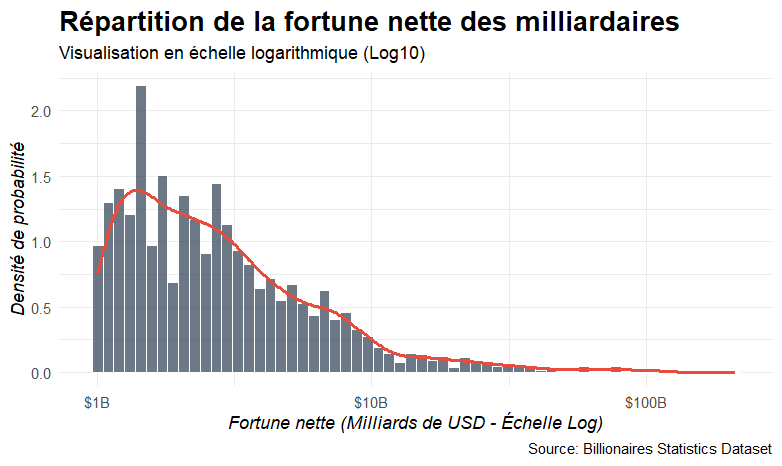

```{r, include=FALSE}
library(tidyr)
library(maps)
library(ggplot2) 
library(dplyr) 
library(readr)
library(ggrepel)
library(stringr)
library(sf)
library(rnaturalearthdata)
library(tidygeocoder)
library(countrycode)
library(stringi)
library(here)
library(scales)
library(patchwork)
library(ggpubr)
library(forcats)

df <- read_csv(here("data", "Billionaires_Statistics_Dataset.csv"))
```
# **Introduction**

## Données

Le [dataset](https://www.kaggle.com/datasets/nelgiriyewithana/billionaires-statistics-dataset/) utilisé par notre groupe contient des données sur les milliardaires à travers le monde contenant 2540 observations et un total de 35 variables.

Ce dataset provient de [Nidula Elgiriyewithana](https://www.linkedin.com/in/nidula/), un ingénieur chercheur en IA et regroupe un ensemble d'informations sur les milliardaires.

La structure du dataset est le suivant :

-   Le classement du milliardaire (rank)
-   Le montant de sa fortune (finalWorth)
-   Le secteur économique dans lequel le milliardaire opère (category, industries)
-   Les informations personnelles du milliardaire (personName, age, country, state, city, countryOfCitizenship, gender, birthDate, ...)
-   L'entreprise à l'origine de leur fortune ou le domaine spécifique à l'origine de la fortune (source)
-   Le nom de l'organisme ou entreprise affiliée actuellement à ces milliardaires (organization)
-   Un indicateur si le milliardaire a produit ou hérité de sa fortune (selfMade, status)
-   L'indice des prix à la consommation (2010 base 100) du pays dans lequel ce milliardaire vit en 2019 (cpi_country)
-   L'inflation des prix en pourcentage entre le début et la fin de l'année 2019 dans lequel ce millionaire vit (cpi_country_change)
-   Le PIB du pays dans lequel ce milliardaire vit (gdp_country)
-   Des informations sur le taux d'éducation dans le primaire et le supérieur du pays dans lequel ce milliardaire vit (gross_tertiary_education_enrollment, gross_primary_education_enrollment_country)
-   L'espérance de vie (life_expectancy_country)
-   Le taux de recettes fiscales en pourcentage du PIB (tax_revenue_country_country)
-   Le taux d'imposition sur les entreprises en pourcentage des bénéfices commerciaux (total_tax_rate_country)
-   La population du pays dans lequel le milliardaire réside (population_country)

Cependant, certaines variables se recoupent. En effet, personName, qui inclut le nom et le prénom, se retrouve dans lastName (nom) et firstName (prénom). La date d'anniversaire entière du milliardaire (birthDate), qui est présente, est divisée aussi dans les données par birthYear, birthMonth et birthDay. Le pays où habite le milliardaire est présent (country), mais, on trouve aussi les coordonnées du pays d'origine du pays (latitude_country,longitude_country). Les variables category et industries sont redondantes.

Ce dataset est composé, pour les variables pertinentes, de données : discrètes, continues et nominale.

Nous avons choisi ce dataset car :

-   Il est complet et toutes les informations nécessaires pour répondre à nos questions y figurent.
-   Nous avons la volonté et la curiosité d'en apprendre plus sur les milliardaires comme la provenance de leur richesse et leur répartition dans le monde nous intéresse.
-   Avec cette large quantitée d'informations variées, il est possible d'obtenir des réponses plus ou moins pertinentes sur des questions qu'on pourrait tous se poser et d'en tirer des conclusions générales d'un point de vue sociologique. (proportions d'hommes/femmes, gagnée par l'héritage ou le travail, etc.)

Notre travail s'articule autour de cette question : Quels facteurs expliquent l'émergence et la concentration des milliardaires?

# **Analyse exploratoire**
## I. Géographie de la richesse mondiale
Les milliardaires ont la possibilité de s’établir où ils le souhaitent en raison de leur revenu. Cependant, le choix de leur résidence n’est pas laissé au hasard. Il peut supposer qu’ils habitent dans des lieux où ils peuvent facilement avoir des opportunités entrepreneuriales, un accès aux meilleures écoles pour leur famille et proche des centres de décisions de leur(s) entreprise(s). Il semble logique que les opportunités de faire croître leur entreprises se trouvent majoritairement dans l’hémisphère nord. Il convient donc de se demander où les milliardaires se concentrent dans le monde.

Problématique de la partie: Où se concentrent les milliardaires dans le monde? 

Q1 - Quelles villes comptent le plus de milliardaires ?
<details>

<summary>Question et problème étudié</summary>
L'objectif est de voir où vivent les milliardaires. On suppose qu'ils vivent dans des mégalopoles dans l'hémisphère Nord où il y a des opportunités économiques intéressantes. On peut penser à new York, Los Angeles, Hong Kong, Londres mais aussi des villes en Chine et d'autres réprésentatives de certains industries iconiques.

</details>
<details>

<summary>Visualisation</summary>
```{r, echo=FALSE}
#Selection des 20 villes les plus peuplées
cities_top_20 <- df%>% filter(!is.na(city)) %>% count(city, sort = TRUE) %>% slice_head(n = 20)

#Diagramme à barre horizontale
data_cities <- ggplot(cities_top_20, aes(x=reorder(city,n), y=n)) + geom_col() + coord_flip() +
  labs(title = "Top 20 des villes avec le plus de milliardaires",
       x = "Ville",
       y = "Nombre de milliardaires")
data_cities
```
Mon choix s'est porté sur un diagramme à barre qui est bien pour montrer une répartition. J'ai choisi de montrer les 20 villes concentrant le plus de milliardaires pour soucis de lisibilité et de pertinence. 
</details>

<details>
<summary>Interprétation et réponse</summary>
La représentation répond à la question. L'hypothèse de départ est vérifiée. New York est en tête de loin et cela peut s'expliquer car la ville concentre énormément d'industries et donc d'opportunités.
</details>


Q3 - Comment se répartissent les milliardaires dans les états américains ?

<details>

<summary>Question et problème étudié</summary>

Les États-Unis sont un grand pays qui concentrent des milliardaires. Cependant, la répartition de la population dans ce pays est inégale donc on suppose que les milliardaires se concentrent dans les grandes villes qui sont dans les états qui concentrent la population (Californie, New York, ...). Les états ruraux comptent pas ou peu de milliardaires en comparaison (Wyoming, ...). L'objectif de cette data visualisation est de vérifier cette hypothèse.

</details>

<details>

<summary>Visualisation</summary>
```{r, echo=FALSE}
american_billionaires <- df %>% 
  filter(country =="United States", !is.na(state)) %>%
  count(state, sort = TRUE) %>% 
  mutate(state = tolower(state), number_of_billionaires = n) %>% 
  select(state, number_of_billionaires)

states_map <- map_data("state")

american_billionaires_map_data <- merge(states_map, american_billionaires, by.x = "region", by.y ="state", all.x = TRUE) %>% mutate(number_of_billionaires = replace_na(number_of_billionaires, 0))

american_billionaires_map <- american_billionaires_map_data %>% ggplot(aes(map_id= region,fill = number_of_billionaires)) +
    geom_map(map = states_map, colour = "black") +
    expand_limits(x = states_map$long, y = states_map$lat) +
    coord_map("polyconic") +
  scale_fill_viridis_c()+
  labs(title="Répartition des milliardaires dans les états américains", x="Longitude", y="Latitude", fill="Nombre de milliardaires" )
american_billionaires_map
```
On a choisi de représenter cela avec une carte pour rendre cela visuel, pour avoir l'information qui accroche le regard. Par ailleurs, représenter cela avec un diagramme à barre, qui convient tout à fait, nous aurait fait perdre de la données car représenter 42 données en abscisse prend de la place. La carte est mieux pour représenter l'ensemble de données.

</details>

<details>
<summary>Interprétation et réponse</summary>
Les états les plus peuplés concentrent le plus de milliardaires : Californie, Texas, Floride et New York. Ce sont les états qui concentrent des villes importantes : Los Angeles, New York, Austin, Dallas, Miami, ... D'autant plus que la Silicon Valley, épicentre des entreprises de la tech américains, se trouvent en Californie, ce qui explique qu'elle compte plus de 150 milliardaires. 
Sans surprise, les autres états comptent entre 0 et 50 milliardaires. 
La visualisation répond à la question. 

</details>


Q8 - Où sont répartis les milliardaires dans le monde ?
<details>
<summary>Question et problème étudié</summary>

On cherche à comprendre la répartition géographique des milliardaires afin de voir si elle est concentrée dans certains pays ou régions du monde.
On s’attend à ce que les milliardaires soient fortement concentrés dans les pays les plus riches et économiquement développés, notamment les États-Unis, la Chine, l’Allemagne, la France et le Royaume-Uni. 
Ces pays offrent des écosystèmes favorables à la création de richesse, avec des marchés financiers matures, des infrastructures solides et des opportunités d’affaires.
opportunités d’affaires.

Le choix du diagramme se portera sur une carte du monde avec des points représentant les villes où résident les milliardaires, la taille des points étant proportionnelle au nombre de milliardaires dans chaque ville. 
Cette visualisation permettra de mettre en évidence les zones de forte concentration de milliardaires à travers le monde.


</details>

<details>
<summary>Visualisation</summary>

```{r stats, eval=FALSE, include=FALSE}
# Filtrage des données pour ne conserver que les villes et pays valides
# Compte le nombre de milliardaires par ville pour former des groupes uniques
villes <- df %>% filter(
    !is.na(city), city != "",
    !is.na(country), country != ""
  ) %>% count(city, country, sort = TRUE)

# Géocodification des villes pour obtenir les coordonnées (latitude et longitude)
villes_geo <- villes %>%
  mutate(location = paste(city, country, sep = ", ")) %>%
  geocode(location, method = "osm", lat = lat, long = lon) %>%
  # Filtrage pour ne conserver que les villes trouvées
  filter(!is.na(lat), !is.na(lon))


## Paramétrage du diagramme
diagramme <- ggplot() +
  geom_sf(data = world, fill = "white", color = "grey80") +
  geom_point(
    data = villes_geo,
    aes(x = lon, y = lat, size = n),
    color = "darkblue",
    alpha = 0.7
  ) +
  scale_size(
    name = "Nombre de milliardaires",
    range = c(0.1, 3),
    trans = "log",
    breaks = c(1,4,8,16,32, 64),
    labels = c("1", "4", "8", "16", "32", "64+")
  ) +
  labs(title = "Répartition des milliardaires dans le monde") +
  theme_void()

diagramme
```

</details>

<details>
<summary>Interprétation et réponse</summary>

Les données confirment globalement nos hypothèses. En majorité, on retrouve les milliardaires dans les pays les plus riches et économiquement développés, que ce soit aux États-Unis, en Chine et en Europe de l’Ouest.
Cependant, on observe aussi des concentrations significatives dans des pays émergents comme l’Inde, qui a vu une croissance économique rapide ces dernières années, créant ainsi de nouvelles opportunités pour la création de richesse. 


</details>

Q9 - Quelle est la nationalité la plus représentée parmi les milliardaires ?
<details>
<summary>Question et problème étudié</summary>

On cherche ici à identifier les nationalités les plus représentées parmi les milliardaires, en se basant sur le dataset fourni.
On s'attends à ce que les pays avec les nationalités les plus représentées soient des pays ayant une forte densité de population ou une économie développée, comme les États-Unis, la Chine, l'Inde, etc.
Cependant, il est également possible que certains pays avec une population plus petite mais une forte concentration de richesse soient bien représentés comme la Suisse.

L'objectif est de comparer les 10 nationalités les plus fréquentes, le choix du diagramme se portera sur un bar chart horizontal, avec les nationalités en ordonnée et le nombre de milliardaires en abscisse, permettant ainsi de visualiser clairement les différences entre les nationalités. 

</details>
<details>
<summary>Visualisation</summary>

```{r echo=FALSE}
# Comptage par nationalité
nationalites <- df %>%
  filter(!is.na(countryOfCitizenship),
         countryOfCitizenship != "") %>%
  count(countryOfCitizenship, sort = TRUE)

# Top 10 nationalités
top10 <- nationalites %>%
  slice(1:10)

## Paramétrage du diagramme et sauvegarde de l'image

diagramme <- ggplot(
  top10,
  aes(
    x = reorder(countryOfCitizenship, n),
    y = n
  )
) +

  geom_col(fill = "darkblue") +

  coord_flip() +

  labs(
    title = "Top 10 des nationalités les plus représentées parmi les milliardaires",
    x = "Nationalité",
    y = "Nombre de milliardaires"
  ) +

  theme_minimal()

```
</details>

<details>
<summary>Interprétation et réponse</summary>

La densité de population semble avoir une bien plus grosse influence que la richesse d'un pays sur le nombre de milliardaires qu'il compte. 
En effet, les États-Unis, la Chine et l'Inde sont les trois pays les plus représentés, alors que des pays comme la Suisse ou le Luxembourg, qui ont une forte concentration de richesse, ne figurent pas dans le top 10.
Cependant, les Etats-Unis, qui ont une population d'environ 330 millions d'habitants, sont largement en tête avec plus de 700 milliardaires, ce qui est bien plus que la Chine (environ 1,4 milliard d'habitants) et l'Inde (environ 1,3 milliard d'habitants).
Cela suggère que la taille de la population est un facteur clé dans le nombre de milliardaires mais que d'autres facteurs semblent également jouer un rôle, comme la culture entrepreneuriale, les opportunités économiques, et les politiques fiscales.
Si ce n'étais pas le cas, on s'attendrait du top 3 d'être composé de la chine ou l'inde en numéro 1 et 2, et les états-unis en numéro 3, ce qui n'est pas le cas.

</details>

Q19 - Quel est le nombre de milliardaires par habitant dans chaque pays ?
<details>
<summary>Question et problème étudié</summary>
</details>

<details>
<summary>Visualisation</summary>
```{r, echo=FALSE}
q11 <- df %>%
  group_by(country, population_country) %>%
  summarise(nb = n(), .groups = "drop") %>%
  filter(!is.na(population_country), population_country > 0) %>%
  mutate(par_million = nb / (population_country / 1e6)) %>%
  arrange(desc(par_million)) %>%
  head(20)

p11 <- ggplot(q11, aes(x = reorder(country, par_million), y = par_million)) +
  geom_col(fill = "#756bb1") +
  coord_flip() +
  labs(
    title = "Milliardaires par million d'habitants",
    subtitle = "Top 20 des pays (2023)",
    x = NULL,
    y = "Milliardaires par million d'habitants"
  ) +
  theme_minimal(base_size = 13)
p11
```
</details>

<details>
<summary>Interprétation et réponse</summary>
</details>

Q25 - Y a-t-il des mouvements de milliardaires entre leur nationalité et leur lieu d'habitation dans le monde ? 
<details>
<summary>Question et problème étudié </summary>
On part du constat que les milliardaires ont la possibilité de bouger et d'habiter des endroits plus favorables au développement de leur business. Cependant, certains ont pu naitre dans des pays peu propices à ce développement. Ainsi, on peut supposer que pour certains profils, il y a une différence entre la nationalité (d'origine, naissance) et leur lieu d'habitation. On propose une vue statique de ces mouvements sur l'année 2023.
</details>

<details>
<summary> Visualisation </summary>
Le diagramme est dans le Shiny app. 
</details>

<details>
<summary> Interprétation et réponse </summary>

</details>
## II. Concentration des capitaux économique, culturel et social

Problématique de la partie: Quels capitaux favorisent l’émergence ou la pérennité de la fortune des milliardaires?  

Q10 - Existe-t-il une corrélation entre la densité de milliardaires pays et le niveau d’éducation d’un pays, mesuré par le taux de scolarisation dans l’enseignement primaire et supérieur ?
<details>
<summary>Question et problème étudié</summary>
</details>

<details>
<summary>Visualisation</summary>
</details>


<details>
<summary>Interprétation et réponse</summary>
</details>

Q21 - Quelle est la proportion de milliardaires ayant hérité de leur fortune par rapport à ceux l'ayant constituée eux-mêmes ?
<details>
<summary>Question et problème étudié</summary>
</details>

<details>
<summary>Visualisation</summary>
</details>


<details>
<summary>Interprétation et réponse</summary>
</details>

Q6 - Quelle est la proportion de milliardaires honorifiés ou titrés ?
<details>
<summary>Question et problème étudié</summary>
</details>

<details>
<summary>Visualisation</summary>
</details>


<details>
<summaryInterprétation et réponse</summary>
</details>


## III. Le mythe du self-made man
Problématique de la partie: Quelles sont les caractéristiques du self-made?

Q7 - Est-ce que les milliardaires dont le statut est “self-made” viennent d’un pays dont le taux d’inscription dans le supérieur est bas ? (ou Le niveau d’accès à l’enseignement supérieur influence-t-il l’émergence de milliardaires self-made ?)
<details>
<summary>Question et problème étudié</summary>

On cherche à analyser la relation entre le statut de "self-made" des milliardaires et le taux d'inscription dans l'enseignement supérieur de leur pays d'origine. 
L'objectif est de déterminer si les milliardaires qui ont construit leur fortune par eux-mêmes proviennent majoritairement de pays où l'accès à l'enseignement supérieur est limité, ce qui pourrait suggérer que ces individus ont dû surmonter des obstacles éducatifs pour réussir.
On s'attend à ce que les milliardaires "self-made" soient plus fréquents dans des pays avec un taux d'inscription dans le supérieur plus bas, car cela pourrait indiquer que ces individus ont dû faire preuve de plus de détermination et d'innovation pour réussir sans bénéficier d'une éducation formelle avancée.
Cependant, il est également possible que certains milliardaires "self-made" proviennent de pays avec un taux d'inscription dans le supérieur élevé, ce qui pourrait indiquer que l'accès à l'éducation n'est pas le seul facteur déterminant pour devenir un milliardaire "self-made".

Le diagramme choisi pour visualiser cette relation sera un scatterplot, avec le taux d'inscription dans le supérieur en abscisse et le nombre de milliardaires "self-made" en ordonnée, permettant ainsi de visualiser toute corrélation potentielle entre ces deux variables.

</details>
<details> <summary> Visualisation</summary>

```{r}

pays <- df %>%
  filter(
    !is.na(country),
    !is.na(gross_tertiary_education_enrollment)
  ) %>%
  group_by(country) %>%
  summarise(
    taux_superieur = first(gross_tertiary_education_enrollment),
    proportion_selfmade = mean(selfMade)
  )


## Paramétrage du diagramme et sauvegarde de l'image


diagramme <- ggplot(
  pays,
  aes(
    x = taux_superieur,
    y = proportion_selfmade * 100
  )
) +

  geom_point(color = "darkblue") +

  geom_smooth(
    method = "lm",
    color = "red"
  ) +

  labs(
    title = "Part des milliardaires self-made et accès à l'enseignement supérieur",
    x = "Taux d'inscription dans le supérieur (%)",
    y = "Part de self-made (%)"
  ) +

  theme_minimal()

print(diagramme)

ggsave(
  "education_scatterplot.png",
  plot = diagramme, width = 8, height = 6
)

```
</details>

<details>
<summary>Interprétation et réponse</summary>

Finalement, on observe une légère tendance à ce que les pays avec un taux d'inscription dans le supérieur plus bas aient une proportion légèrement plus élevée de milliardaires "self-made". 
Cependant, la corrélation n'est pas très forte, ce qui suggère que d'autres facteurs, tels que l'environnement économique, les opportunités d'affaires et les politiques gouvernementales, peuvent également jouer un rôle important dans la réussite des milliardaires "self-made".

</details>

Q18 - Peut-on deviner si un milliardaire s'est fait tout seul à partir de son profil ?
<details>
<summary>Question et problème étudié</summary>
</details>

<details>
<summary>Visualisation</summary>
```{r, echo=FALSE}
q20 <- df %>%
  filter(!is.na(selfMade), !is.na(age), !is.na(gender)) %>%
  mutate(selfMade = ifelse(selfMade, "Self-made", "Hérité"))

p20 <- ggplot(q20, aes(x = age, y = finalWorth / 1e3, color = selfMade)) +
  geom_point(alpha = 0.4, size = 1.5) +
  scale_y_log10(labels = scales::comma_format()) +
  facet_wrap(~gender, labeller = labeller(gender = c(M = "Hommes", F = "Femmes"))) +
  scale_color_manual(values = c("Self-made" = "#1b9e77", "Hérité" = "#d95f02")) +
  labs(
    title = "Profil des milliardaires : Self-made vs Hérité",
    subtitle = "Fortune (échelle log) en fonction de l'âge, par genre",
    x = "Âge",
    y = "Fortune (milliards $, échelle log)",
    color = "Statut"
  ) +
  theme_minimal(base_size = 13) +
  theme(legend.position = "bottom")
p20
```
</details>

<details>
<summary>Interprétation et réponse</summary>
</details>

Q23 - Les hommes milliardaires sont-ils plus souvent self-made que les femmes ?
<details>
<summary>Question et problème étudié</summary>
</details>

<details>
<summary>Visualisation</summary>
```{r echo=FALSE}
df_clean <- df %>%
  filter(!is.na(gender), !is.na(selfMade)) %>%
  mutate(
    Genre    = if_else(gender == "M", "Homme", "Femme"),
    SelfMade = if_else(selfMade == TRUE, "Self-made", "Hérité / Autre")
  )
col_selfmade <- c("Self-made"     = "#2C6E9B",
                  "Hérité / Autre" = "#E07B39")

col_genre    <- c("Homme" = "#2C6E9B",
                  "Femme" = "#E07B39")

selfmade_by_genre <- df_clean %>%
  count(Genre, SelfMade) %>%
  group_by(Genre) %>%
  mutate(
    pct   = n / sum(n),
    total = sum(n),
    label = paste0(percent(pct, accuracy = 0.1), "\n(n=", comma(n), ")")
  ) %>%
  ungroup() %>%
  mutate(SelfMade = fct_relevel(SelfMade, "Self-made", "Hérité / Autre"))

p2 <- ggplot(selfmade_by_genre,
             aes(x = Genre, y = pct, fill = SelfMade)) +
  geom_col(position = "fill", width = 0.55, colour = "white", linewidth = 0.6) +
  geom_text(aes(label = label),
            position = position_fill(vjust = 0.5),
            colour = "white", size = 3.5, fontface = "bold", lineheight = 1.3) +
  # Annotation : effectif total par genre sous l'axe
  geom_text(data = selfmade_by_genre %>% distinct(Genre, total),
            aes(x = Genre, y = -0.04,
                label = paste0("N = ", comma(total))),
            inherit.aes = FALSE,
            colour = "grey40", size = 3.2) +
  scale_fill_manual(values = col_selfmade) +
  scale_y_continuous(labels = percent_format(),
                     limits = c(-0.07, 1.01),
                     expand = c(0, 0)) +
  labs(
    title    = "Répartition des selfMade selon le genre",
    x = NULL, y = NULL, fill = NULL
  ) +
  theme_minimal(base_size = 12) +
  theme(
    plot.title      = element_text(face = "bold", size = 13),
    plot.subtitle   = element_text(colour = "grey50", size = 10),
    legend.position = "bottom",
    legend.key.size = unit(0.4, "cm"),
    panel.grid.major.x = element_blank(),
    panel.grid.minor  = element_blank()
  )
p2
```

</details>

<details>
<summary>Interprétation et réponse</summary>
</details>

## IV. Concentration des richesses et des industries
Problématique de la partie: Comment se concentrent la richesse des milliardaires? 

Q12 - Quels sont les points communs entre les riches dans le monde?
<details>
<summary>Question et problème étudié</summary>
</details>

<details>
<summary>Visualisation</summary>
</details>

<details>
<summaryInterprétation et réponse</summary>
</details>

Q14 - Comment se répartit la richesse des milliardaires ?
<details>
<summary>Question et problème étudié</summary>
</details>

<details>
<summary>Visualisation</summary>
```{r, echo=FALSE}
q14 <- df %>%
  group_by(industries) %>%
  summarise(
    nb = n(),
    richesse_totale = sum(finalWorth, na.rm = TRUE) / 1e3 
  ) %>%
  arrange(desc(richesse_totale)) %>%
  head(10)

p14 <- ggplot(q14, aes(x = reorder(industries, richesse_totale), y = richesse_totale)) +
  geom_col(aes(fill = richesse_totale), show.legend = FALSE) +
  scale_fill_gradient(low = "#fdae6b", high = "#d94701") +
  coord_flip() +
  labs(
    title = "Répartition de la richesse par industrie",
    subtitle = "Richesse cumulée des milliardaires (top 10 industries)",
    x = NULL,
    y = "Richesse totale (milliards $)"
  ) +
  theme_minimal(base_size = 13)
p14
```

</details>


<details>
<summary>Interprétation et réponse</summary>
</details>

Q15 - Quelles sont les différents types d'industrie qui sont les plus représentés ? (intégré Q4 - Est-ce qu’il y a des sources de richesse récurrentes parmi leIndustries/secteurs) 
<details>
<summary>Question et problème étudié</summary>
</details>

<details>
<summary>Visualisation</summary>
</details>


<details>
<summary>Interprétation et réponse</summary>
</details>


Suite à cette question, nous avons choisi de détailler celle-ci en regardant les sources de la fortune des milliardaires. Dans "sources", on trouve soit le nom d'une entreprise pour les plus connues ou le secteur précis.

<details>
<summary>Question et problème étudié</summary>

L'objectif de cette data visualisation est de voir plus précisement où se concentrent les milliardaires. Les données ne sont pas nettoyées donc l'analyse risque d'être partielle. On imagine que dans l'investissement et l'agrobusiness, il y a beaucoup de milliardaires. On suppose que les entreprises les plus connues des plus gros milliardaires ne seront pas représentées (LVMH, Amazon, Microsoft,...) car cela ne concerne que peu de personne. 

À noter : N'est affiché dans le bar chart les occurences de sources supérieures à 7 pour plus de lisibilité. En dessous de 7, la source est renommé en "others".

</details>

<details>
<summary>Visualisation</summary>

```{r, echo=FALSE}

#Sélection des secteurs où il y a le plus de milliardaires

economic_sector_top5 <- df %>%
  filter(!is.na(industries)) %>%
  mutate(industries = tolower(industries)) %>%
  count(industries, sort = TRUE) %>%
  slice_head(n = 5)

#Dictionnaire
source_dictionary <- c(

  # Retail
  "retailing" = "retail",
  "retailer" = "retail",

  # Software
  "software service" = "software",
  "business software" = "software",
  "software company" = "software",

  # Finance
  "investing" = "investment",
  "investment firm" = "investment",
  "private equity" = "investment",

  # Real estate
  "property" = "real estate",
  "realestate" = "real estate",
  "real estate development" = "real estate",

  # Electronics
  "electronics component" = "electronic component",
  "semiconductor" = "electronic component",

  # Commerce
  "ecommerce" = "e commerce",
  "e commerce" = "e commerce",
  "online retail" = "e commerce",

  # Convenience stores
  "convinience store" = "convenience store",
  
  #Eyeglasses
  "eyeglase" = "eyeglasse"
)

# Fonction de nettoyage 

clean_source <- function(x) {

  x <- tolower(x)

  # suppression accents
  x <- stringi::stri_trans_general(x, "Latin-ASCII")

  # uniformisation séparateurs
  x <- str_replace_all(x, "[-_/]", " ")

  # suppression ponctuation
  x <- str_replace_all(x, "[[:punct:]]", "")

  # espaces multiples
  x <- str_squish(x)

  # singulier simple
  x <- str_replace(x, "ies$", "y")
  x <- str_replace(x, "s$", "")

  x
}

#Sélection des données

data_top5 <- df %>%
  filter(
    !is.na(industries),
    !is.na(source)
  ) %>%
  mutate(
    industries = tolower(industries),
    source = clean_source(source)
  ) %>%
  semi_join(
    economic_sector_top5,
    by = "industries"
  ) %>%
  mutate(
    source = recode(
      source,
      !!!source_dictionary,
      .default = source
    )
  )

#Comptages du nombre de sources de richesses

eco_sector_source <- data_top5 %>%
  count(
    industries,
    source,
    name = "n"
  )

#regroupement des petites sources pour plus de lisibilité

eco_sector_source <- eco_sector_source %>%
  group_by(industries) %>%
  mutate(
    source = if_else(
      n < 7,
      "others",
      source
    )
  ) %>%
  ungroup() %>%
  group_by(industries, source) %>%
  summarise(
    n = sum(n),
    .groups = "drop"
  )

#Mise en pourcentage de chaque part des sources dans le diagramme

eco_sector_source_pct <- eco_sector_source %>%
  group_by(industries) %>%
  mutate(
    total_industry = sum(n),
    pct = n / total_industry
  ) %>%
  ungroup()

# bar chart cumulé

economic_sector_bar_chart_2 <- eco_sector_source_pct %>%
  mutate(industries = reorder(industries, n, FUN = sum))%>%
  ggplot(
  aes(
    x = industries,
    y = pct,
    fill = source
  )
) +
  geom_col() +

  scale_y_continuous(
    labels =scales::percent
  ) +
  geom_text(
    aes(
      label = source), 
    position = position_stack(vjust = 0.5), 
    colour = "white"
    ) +

  labs(
    title = "Sources de richesse des milliardaires",
    subtitle = "Répartition dans les 5 secteurs les plus représentés",
    x = "Secteur économique",
    y = "Part des milliardaires",
    fill = "Source de richesse"
  ) +

  theme_minimal(base_size = 7)

economic_sector_bar_chart_2

```

Le choix s'est porté sur un bar chart stacké en pourcentage pour faciliter la lecture du nombre de milliardaires dans chaque industrie. On a choisi des couleurs assez différentes pour respecter la magnitude estimation.
</details>

<details>

<summary>Interprétation et réponse</summary>
L'hypothèse de départ est validée mais incomplète car il y a des secteurs non cités qui représentent une part non négligeable de milliardaires. La limitaiton à sept du nombre d'occurences affaiblit l'interprétation malgré le tri fait sur les données.


</details>

Q17 - Quelle est la répartition des milliardaires dans les différentes industries ?
<details>

<summary>Question et problème étudié</summary>

On se demande dans quelles industries on trouve le plus de milliardaires. Est-ce que c'est réparti à peu près équitablement, ou est-ce que quelques secteurs dominent largement ?

On parie plutôt sur la seconde option : la finance, la tech et l'industrie devraient concentrer la majorité des fortunes.

</details>

<details>

<summary> Visualisation </summary>
```{r, echo=FALSE}
q15 <- df %>%
  count(industries, sort = TRUE) %>%
  head(15)

p15 <- ggplot(q15, aes(x = reorder(industries, n), y = n)) +
  geom_col(fill = "#2c7fb8") +
  coord_flip() +
  labs(
    title = "Top 15 des industries les plus représentées",
    subtitle = "Nombre de milliardaires par industrie (2023)",
    x = NULL,
    y = "Nombre de milliardaires"
  ) +
  theme_minimal(base_size = 13)
p15
```

Un diagramme en barres horizontales du Top 15 des industries, trié du plus grand au plus petit. Les barres horizontales permettent de lire plus facilement les noms, et la longueur reste le meilleur canal pour comparer des effectifs d'un coup d'œil.
</details>

<details>

<summary>Interprétation et réponse</summary>

Sans surprise, c'est très inégal. Finance & Investments, Manufacturing et Technology sont dominants avec 300 à 370 milliardaires chacun. Derrière (Fashion & Retail, Food & Beverage, Healthcare, Real Estate, Diversified) se tient autour de 180–270. Puis tout le reste tombe sous la barre des 100 : Energy, Media, Automotive, Logistics…

Ça colle avec ce qu'on observe dans l'économie réelle, les actualités, etc. : les secteurs où circule le plus de capital (finance, tech) ou (manufacturing) produisent plus de très grandes fortunes.

Cela justifie l'essor du numérique, et les tendances économiques qui l'accompagne. 

</details>

## V. Indicateurs de santé économique

Problématique de la partie: Quels facteurs économiques ont une influence sur la présence des milliardaires? 

Q2 - Existe-il une corrélation entre la densité des milliardaires par million d'habitants et le niveau d'inflation sur l'année 2019 ?

<details>
<summary>Question et problème étudié</summary>

On entend régulièrement qu'une bonne santé économique favorise l'émergence et la prosperité des entreprises. Or, une inflation haute et/ou peu maitrisée ferait fuir les patrons de ces entreprises, dont les milliardaires, qui iraient délocaliser la production de leur entreprise et quitteraient leur pays d'habitation. Il serait intéressant de tester cette hypothèse. 


</details>
<details>
<summary> Visualisation </summary>

```{r, echo=FALSE}
#Calcul de la densité des milliardaires par pays 
density <- df %>%
  filter(
    !is.na(country
           ), 
    !is.na(population_country
           ), 
    !is.na(cpi_change_country
           )
    ) %>%
  group_by(country) %>%
  summarise(
    nb_billionnaires = n(),
    population = first(population_country),
    inflation = first(cpi_change_country),
    .groups = "drop"
  ) %>%
  mutate(
    density = nb_billionnaires * 1e6 / population
  )%>%
  arrange(desc(density))

infla_and_billionaires <- density %>% 
  ggplot(
    aes(
      x=inflation, 
      y=density
      )
    ) + 
  geom_point(
    shape = 10
    ) + 
  stat_smooth(
    method=lm, 
    se = FALSE
    ) + 
  stat_regline_equation(
    aes(label = after_stat(eq.label)), 
    label.x = 8,
    label.y = max(density$density) * 0.95
  ) +
labs(title = "Corrélation entre niveau d'inflation en 2019 et nombre de milliardaires par million d'habitants",
       x = "Inflation sur l'année 2019 (%)",
       y = "Milliardaires par million d'habitants") + 
       geom_label_repel(
         aes(
           label = country
           ), 
         size = 3
         )

infla_and_billionaires
```


```{r echo=FALSE}
result <- cor.test(
  density$density,
  density$inflation
)
result
```

</details>

<details>
<summary>Interprétation et réponse</summary>
L'analyse de corrélation de Pearson montre une relation négative faible entre le taux d'inflation et la densité de milliardaires (r=−0,163). Cependant, cette corrélation n'est pas statistiquement significative car p=0,199. L'intervalle de confiance à 95 % de la corrélation inclut zéro [−0,393;0,087]. On ne peut alors pas conclure à l'existence d'une relation linéaire entre ces deux variables. Ainsi, le niveau d'inflation observé en 2019 ne semble pas être corrêlé à la densité de milliardaires.
On peut ajouter des éléments à cette analyse comme la difficulté de délocaliser ses entreprises, la fiscalité, la taille du marché financier ou le niveau de développement économique qui pourraient jouer sur la relation linéaire. 


</details>


Q13 - Le taux d’imposition a-t-il une influence sur le nombre de milliardaires par pays ?
<details>
<summary>Question et problème étudié</summary>

On se demande maintenant si le taux d’imposition sur les entreprises dans un pays a une influence sur le nombre de milliardaires qu’il compte.
On s’attend à ce que les pays avec des taux d’imposition plus bas attirent davantage de milliardaires, car ils offrent un environnement fiscal plus favorable pour la création et la préservation de la richesse.
Cependant, il est important de noter que d’autres facteurs, tels que la stabilité politique, les infrastructures, les opportunités économiques et la qualité de vie, peuvent également jouer un rôle crucial dans l’attraction des milliardaires, ce qui pourrait atténuer l’impact du taux d’imposition.

La question est donc de savoir s’il existe une corrélation. De ce fait, le diagramme sera un scatterplot avec le taux d’imposition sur les entreprises en abscisse et le nombre de milliardaires en ordonnée, avec une ligne de tendance pour visualiser la corrélation.

</details>
<details>
<summary> Visualisation </summary>

```{r}
# Agrégation par pays
pays_stats <- df %>%
  filter(
    !is.na(country),
    !is.na(total_tax_rate_country)
  ) %>%
  group_by(country) %>%
  summarise(
    nb_milliardaires = n(),
    taux_imposition = first(total_tax_rate_country)
  )

## Paramétrage du diagramme et sauvegarde de l'image
diagramme <- ggplot(pays_stats,
       aes(x = taux_imposition,
           y = nb_milliardaires)) +

  geom_point(
    color = "darkblue",
    alpha = 0.7,
    size = 3
  ) +

  geom_smooth(
    method = "lm",
    se = TRUE,
    color = "red"
  ) +

  labs(
    title = "Influence du taux d'imposition sur le nombre de milliardaires",
    x = "Taux d'imposition sur les entreprises (%)",
    y = "Nombre de milliardaires"
  )

diagramme

ggsave(
  "tax_vs_billionaires.png",
  diagramme,
  width = 10,
  height = 6
)
```
</details>
<details>
<summary>Interprétation et réponse</summary>

Visiblement, il n’y a pas de corrélation claire entre le taux d’imposition sur les entreprises et le nombre de milliardaires par pays.
Sauf quelques outliers, la plupart des pays avec des taux d’imposition variés ont des nombres de milliardaires similaires, ce qui suggère que le taux d’imposition n’est pas un facteur déterminant pour l’attraction ou la rétention des milliardaires.
Cependant, les outliers trois outliers respectivement les États-Unis, la Chine et l’Inde sont les pays avec le plus de milliardaires et avec aussi le plus grand nombre d’habitants, ce qui peut laisser supposer que le nombre de milliardaires est plus influencé par la taille de la population et l’économie globale du pays que par le taux d’imposition.

</details>

## VI. Profil démographique

Problématique de la partie: Quel serait le profil démorgraphique du milliardaire?

Q5 - Y a-t-il un lien entre l'âge et la richesse ?

<details>
<summary>Question et problème étudié</summary> 
</details>

<details>
<summary>Visualisation</summary>
```{r echo=FALSE}
age_rich_dt <- df %>% 
  select(finalWorth, age) %>% 
  mutate(finalWorth = finalWorth/1000)

infla_and_billionaires <- age_rich_dt %>% 
  ggplot(aes(x=age, y=finalWorth)) + 
  geom_point(shape = 10) + 
  stat_smooth(method=lm, se = FALSE) + 
  stat_regline_equation(
    aes(label = after_stat(eq.label)), 
    label.x = 8,
    label.y = max(age_rich_dt$age) * 0.95
  ) +
labs(title = "Corrélation entre l'âge et la richesse",
       x = "Age",
       y = "Richesse") 
infla_and_billionaires

result <- cor.test(
  age_rich_dt$age,
  age_rich_dt$finalWorth,
  method="spearman"
)
result
model_age <- lm(
  log(finalWorth) ~ age,
  data = age_rich_dt
)

summary(model_age)

```
</details>

<details>
<summary> Interprétation et réponse</summary>
</details>


Q11 - Quelle est la répartition de l’âge des milliardaires en 2023 ?
<details>
<summary>Question et problème étudié</summary>

On cherche à comprendre la répartition de l'âge des milliardaires en 2023, afin de voir si elle est concentrée dans certaines tranches d'âge ou si elle est plus uniformément répartie.
On s'attends à ce que la majorité des milliardaires soient âgés de 50 à 70 ans, car c'est généralement à cet âge que les individus ont eu suffisamment de temps pour accumuler une grande richesse. 
Cependant, il est également possible de trouver des milliardaires plus jeunes, notamment dans le secteur de la technologie, où des entrepreneurs peuvent atteindre une grande richesse à un âge relativement jeune.

Le choix du diagramme se portera sur un histogramme de l'âge des milliardaires, avec des barres représentant le nombre de milliardaires dans différentes tranches d'âge (par exemple, 0-20 ans, 21-30 ans, etc.).
Cette visualisation permettra de mettre en évidence les tranches d'âge les plus représentées parmi les milliardaires en 2023.

</details>

<details>
<summary>Visualisation</summary>

```{r}
# Suppression des âges manquants
ages <- df %>%
  filter(!is.na(age))


## Paramétrage du diagramme et sauvegarde de l'image

diagramme <- ggplot(
  ages,
  aes(x = age)
) +

  geom_histogram(
    binwidth = 1,
    fill = "darkblue",
    color = "white"
  ) +

  labs(
    title = "Répartition de l'âge des milliardaires en 2023",
    x = "Âge",
    y = "Nombre de milliardaires"
  ) +

  theme_minimal()
```
</details>

<details>
<summary>Interprétation et réponse</summary>

Comme nous le pensions, la majorité des milliardaires étaient âgés d'environ 48 à 83 ans, avec une concentration plus forte entre 50 et 70 ans.
Cependant, on observe aussi une présence significative de milliardaires plus jeunes, notamment dans la tranche d'âge de 30 à 40 ans, ce qui peut être attribué à la montée en puissance du secteur de la technologie et à l'émergence de jeunes entrepreneurs qui ont réussi à accumuler une grande richesse rapidement.

</details>
Q20 - Quelle est la génération qui regroupe le plus grand nombre de milliardaires ?
<details>

<summary>Question et problème étudié</summary>

Avant d'analyser les données, plusieurs hypothèses peuvent être formulées.
Les anciennes générations (Génération X et surtout Baby-Boomers) devraient largement dominer le classement, grâce à des conditions favorables d’accumulation du capital, notamment dans des secteurs comme l'immobilier, la finance et l'industrie et à leur position centrale lors de la révolution technologique (Google, Amazon, Apple, Nvidia).

À l’inverse, les Millennials devraient rester minoritaires en raison de leur âge, tandis que la Génération Z serait quasi absente. Les générations plus anciennes, enfin, verraient leur présence réduite par des facteurs démographiques.

</details>

<details>

<summary>Visualisation</summary>

Un diagramme en barres verticales présente le nombre et le pourcentage de milliardaires par génération, de la plus ancienne à la plus récente, afin de comparer clairement leur poids relatif.


```{r}
# Définition des générations selon birthYear
billionaires_gen <- df %>%
  filter(!is.na(birthYear)) %>%
  mutate(generation = case_when(
    birthYear >= 1997 & birthYear <= 2012 ~ "Génération Z\n(1997–2012)",
    birthYear >= 1981 & birthYear <= 1996 ~ "Millennials\n(1981–1996)",
    birthYear >= 1965 & birthYear <= 1980 ~ "Génération X\n(1965–1980)",
    birthYear >= 1946 & birthYear <= 1964 ~ "Baby-Boomers\n(1946–1964)",
    birthYear >= 1928 & birthYear <= 1945 ~ "Génération silencieuse\n(1928–1945)",
    birthYear <  1928                     ~ "Génération GI\n(avant 1928)",
    TRUE ~ NA_character_
  )) %>%
  filter(!is.na(generation))

# Comptage par génération
gen_counts <- billionaires_gen %>%
  count(generation, name = "n_billionaires") %>%
  mutate(
    generation = factor(generation, levels = c(
      "Génération GI\n(avant 1928)",
      "Génération silencieuse\n(1928–1945)",
      "Baby-Boomers\n(1946–1964)",
      "Génération X\n(1965–1980)",
      "Millennials\n(1981–1996)",
      "Génération Z\n(1997–2012)"
    ))
  )


# Visualisation
ggplot(gen_counts, aes(x = generation, y = n_billionaires, fill = n_billionaires)) +
  geom_col(width = 0.65, show.legend = FALSE) +
  geom_text(
    aes(label = paste0(n_billionaires, "\n(", round(n_billionaires / sum(n_billionaires) * 100, 1), "%)")),
    vjust = -0.4,
    size  = 3.5,
    fontface = "bold",
    color = "grey30"
  ) +
  scale_fill_gradient(low = "#a8d0f0", high = "#0d47a1", guide = "none") +
  scale_y_continuous(
    expand = expansion(mult = c(0, 0.18)),  # 0.12 → 0.18
    labels = scales::comma
  ) +
  labs(
    title    = "Distribution des milliardaires par génération",
    subtitle = "Quelle génération compte le plus grand nombre de milliardaires ?",
    x        = NULL,
    y        = "Nombre de milliardaires",
    caption  = "Source : Billionaires Statistics Dataset (2023)"
  ) +
  theme_minimal(base_size = 13) + 
  theme(
    plot.title       = element_text(face = "bold", size = 15, margin = margin(b = 4)),
    plot.subtitle    = element_text(color = "grey45", size = 11, margin = margin(b = 12)),
    plot.caption     = element_text(color = "grey60", size = 9, hjust = 1),
    axis.text.x      = element_text(size = 9, lineheight = 1.2),
    axis.text.y      = element_text(color = "grey50"),
    panel.grid.major.x = element_blank(),
    panel.grid.minor   = element_blank(),
    plot.margin      = margin(16, 16, 12, 16)
  )
```

</details>

<details>

<summary>Interprétation et réponse</summary>

Les données confirment clairement nos hypothèses.
Les Baby-Boomers sont la génération la plus représentée (49,2 %), et, avec la Génération X (26,2 %), concentrent plus de 75 % des milliardaires. Cette domination s’explique par leur position favorable dans le temps, leur ayant permis d’accumuler du capital et de profiter pleinement des grandes phases de création de richesse.

La Génération silencieuse reste significative (19,8 %), principalement grâce à des patrimoines issus du capitalisme industriel et souvent transmis ou conservés sur le long terme.

À l’opposé, les Millennials restent marginaux (3,9 %), tandis que la Génération Z est presque inexistante dans l’échantillon (0,2 %).

</details>

Q22 - Quelle est la proportion de femmes et d’hommes parmi les milliardaires en 2023 ?
<details>
<summary>Question et problème étudié</summary>
</details>

<details>
<summary>Visualisation</summary>
```{r echo=FALSE}
df_clean <- df %>%
  filter(!is.na(gender), !is.na(selfMade)) %>%
  mutate(
    Genre    = if_else(gender == "M", "Homme", "Femme"),
    SelfMade = if_else(selfMade == TRUE, "Self-made", "Hérité / Autre")
  )

# Encodage par couleur
col_selfmade <- c("Self-made"     = "#2C6E9B",
                  "Hérité / Autre" = "#E07B39")

col_genre    <- c("Homme" = "#2C6E9B",
                  "Femme" = "#E07B39")


gender_counts <- df_clean %>%
  count(Genre) %>%
  mutate(pct = n / sum(n),
         label = paste0(Genre, "\n", comma(n), "\n(", percent(pct, accuracy = 0.1), ")"))

p1 <- ggplot(gender_counts, aes(x = "", y = pct, fill = Genre)) +
  geom_col(width = 0.55, colour = "white", linewidth = 0.6) +
  geom_text(aes(label = label),
            position = position_stack(vjust = 0.5),
            colour = "white", size = 3.8, fontface = "bold", lineheight = 1.3) +
  coord_flip() +
  scale_fill_manual(values = col_genre) +
  scale_y_continuous(labels = percent_format(), expand = c(0, 0)) +
  labs(
    title    = "Répartition des milliardaires selon le genre",
    subtitle = paste0("N = ", comma(sum(gender_counts$n)), " milliardaires"),
    x = NULL, y = NULL, fill = NULL
  ) +
  theme_minimal(base_size = 12) +
  theme(
    plot.title      = element_text(face = "bold", size = 13),
    plot.subtitle   = element_text(colour = "grey50", size = 10),
    legend.position = "none",
    axis.text       = element_blank(),
    panel.grid      = element_blank()
  )
p1
```
</details>

<details>
<summary>Interprétation et réponse</summary>
</details>

##VII. Questions annexes

Q16 - Dans quel(s) mois sont nés les milliardaires ?
<details>
<summary>Question et problème étudié</summary>
</details>

<details>
<summary>Visualisation</summary>

```{r echo=FALSE}
mois_labels <- c("Jan","Fév","Mar","Avr","Mai","Jun",
                 "Jul","Aoû","Sep","Oct","Nov","Déc")

q16 <- df %>%
  filter(!is.na(birthMonth)) %>%
  count(birthMonth) %>%
  mutate(mois = factor(mois_labels[birthMonth], levels = mois_labels))

p16 <- ggplot(q16, aes(x = mois, y = n)) +
  geom_col(fill = "#41ae76") +
  geom_hline(yintercept = mean(q16$n), linetype = "dashed", color = "red") +
  annotate("text", x = 12, y = mean(q16$n) + 8, label = "Moyenne",
           color = "red", size = 3.5) +
  labs(
    title = "Mois de naissance des milliardaires",
    subtitle = "Distribution mensuelle — la ligne rouge indique la moyenne",
    x = "Mois",
    y = "Nombre de milliardaires"
  ) +
  theme_minimal(base_size = 13)
p16
```
</details>

<details>
<summary>Interprétation et réponse</summary>
</details>

## Question 1 : Comment se répartit la richesse des billionaires ?

<details>
<summary>Question et problème étudié</summary>

On cherche ici à comprendre la structure de la richesse au sein même du club des milliardaires. La question est de savoir si la fortune est répartie de manière "homogène" (la plupart des milliardaires ayant des fortunes similaires) ou si elle est extrêmement concentrée au sommet.

L'hypothèse est une distribution suivant une **loi de puissance** : une immense majorité de "petits" milliardaires (entre 1 et 5 milliards) et une poignée d'individus possédant des fortunes dépassant l'entendement, créant une inégalité flagrante même au sein de l'élite.

</details>

<details>
<summary>Visualisation</summary>

Pour cette analyse, un **histogramme combiné à une courbe de densité** est idéal. Nous utilisons une **échelle logarithmique** sur l'axe des abscisses.



</details>

<details>
<summary>Interprétation et réponse</summary>

L'analyse confirme une asymétrie radicale de la richesse :

La masse des "petits" milliardaires : La plus haute densité (le sommet de la courbe) se situe juste après le seuil de 1 milliard de dollars. C'est là que se trouve le "gros des troupes".

La "Longue Traîne" (Long Tail) : Plus on avance vers la droite (vers les 10, 50, 100 milliards), plus le nombre de personnes chute drastiquement.

Le club des Centimilliardaires : Les individus comme Bernard Arnault ou Elon Musk sont des "outliers" (données aberrantes statistiquement). Leur richesse est si élevée qu'ils forment une catégorie à part entière, presque déconnectée du reste du classement.

En conclusion, la richesse des milliardaires ne suit pas une courbe en cloche (normale). C'est un système où "le gagnant rafle presque tout", reflétant les dynamiques de capitalisation boursière où quelques entreprises dominantes propulsent leurs propriétaires vers des sommets isolés.

</details>

