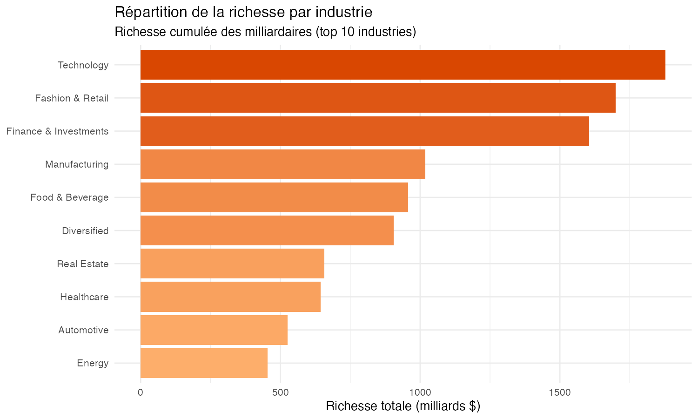
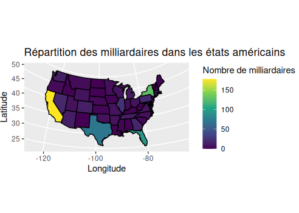

# **Introduction**

## Données

Le [dataset](https://www.kaggle.com/datasets/nelgiriyewithana/billionaires-statistics-dataset/) utilisé par notre groupe contient des données sur les milliardaires à travers le monde contenant 2540 observations et un total de 35 variables.

Ce dataset provient de [Nidula Elgiriyewithana](https://www.linkedin.com/in/nidula/), un ingénieur chercheur en IA et regroupe un ensemble d'informations sur les milliardaires.

La structure du dataset est le suivant :

-   Le classement du milliardaire (rank)
-   Le montant de sa fortune (finalWorth)
-   Le secteur économique dans lequel le milliardaire opère (category, industries)
-   Les informations personnelles du milliardaire (personName, age, country, state, city, countryOfCitizenship, gender, birthDate, ...)
-   L'entreprise à l'origine de leur fortune ou le domaine spécifique à l'origine de la fortune (source)
-   Le nom de l'organisme ou entreprise affiliée actuellement à ces milliardaires (organization)
-   Un indicateur si le milliardaire a produit ou hérité de sa fortune (selfMade, status)
-   L'indice des prix à la consommation (2010 base 100) du pays dans lequel ce milliardaire vit en 2019 (cpi_country)
-   L'inflation des prix en pourcentage entre le début et la fin de l'année 2019 dans lequel ce millionaire vit (cpi_country_change)
-   Le PIB du pays dans lequel ce milliardaire vit (gdp_country)
-   Des informations sur le taux d'éducation dans le primaire et le supérieur du pays dans lequel ce milliardaire vit (gross_tertiary_education_enrollment, gross_primary_education_enrollment_country)
-   L'espérance de vie (life_expectancy_country)
-   Le taux de recettes fiscales en pourcentage du PIB (tax_revenue_country_country)
-   Le taux d'imposition sur les entreprises en pourcentage des bénéfices commerciaux (total_tax_rate_country)
-   La population du pays dans lequel le milliardaire réside (population_country)

Cependant, certaines variables se recoupent. En effet, personName, qui inclut le nom et le prénom, se retrouve dans lastName (nom) et firstName (prénom). La date d'anniversaire entière du milliardaire (birthDate), qui est présente, est divisée aussi dans les données par birthYear, birthMonth et birthDay. Le pays où habite le milliardaire est présent (country), mais, on trouve aussi les coordonnées du pays d'origine du pays (latitude_country,longitude_country). Les variables category et industries sont redondantes.

Ce dataset est composé, pour les variables pertinentes, de données : discrètes, continues et nominale.

Nous avons choisi ce dataset car :

-   Il est complet et toutes les informations nécessaires pour répondre à nos questions y figurent.
-   Nous avons la volonté et la curiosité d'en apprendre plus sur les milliardaires comme la provenance de leur richesse et leur répartition dans le monde nous intéresse.
-   Avec cette large quantitée d'informations variées, il est possible d'obtenir des réponses plus ou moins pertinentes sur des questions qu'on pourrait tous se poser et d'en tirer des conclusions générales d'un point de vue sociologique. (proportions d'hommes/femmes, gagnée par l'héritage ou le travail, etc.)

# **Analyse exploratoire**

\## Question 1 : Comment se répartit la richesse des billionaires ?

\## Question 2 : Quelle est la répartition des milliardaires dans les différentes industries ?

Question et problème étudié

On se demande dans quelles industries on trouve le plus de milliardaires. Est-ce que c'est réparti à peu près équitablement, ou est-ce que quelques secteurs dominent largement ?

On parie plutôt sur la seconde option : la finance, la tech et l'industrie devraient concentrer la majorité des fortunes.

Visualisation

Un diagramme en barres horizontales du Top 15 des industries, trié du plus grand au plus petit. Les barres horizontales permettent de lire plus facilement les noms, et la longueur reste le meilleur canal pour comparer des effectifs d'un coup d'œil.

Interprétation et réponse

Sans surprise, c'est très inégal. Finance & Investments, Manufacturing et Technology sont dominants avec 300 à 370 milliardaires chacun. Derrière (Fashion & Retail, Food & Beverage, Healthcare, Real Estate, Diversified) se tient autour de 180–270. Puis tout le reste tombe sous la barre des 100 : Energy, Media, Automotive, Logistics…

Ça colle avec ce qu'on observe dans l'économie réelle, les actualités, etc. : les secteurs où circule le plus de capital (finance, tech) ou (manufacturing) produisent plus de très grandes fortunes.

Cela justifie l'essor du numérique, et les tendances économiques qui l'accompagne. 

\## Question 3 :

\## Question 4 : Où sont répartis les milliardaires dans le monde ?

\## Question 5 : Comment se répartissent les milliardaires dans les états américains ?

Question et problème étudié

Les États-Unis sont un grand pays qui concentrent des milliardaires. Cependant, la répartition de la population dans ce pays est inégale donc on suppose que les milliardaires se concentrent dans les grandes villes qui sont dans les états qui concentrent la population (Californie, New York, ...). Les états ruraux comptent pas ou peu de milliardaires en comparaison (Wyoming, ...). L'objectif de cette data visualisation est de vérifier cette hypothèse.

Visualisation

On a choisi de représenter cela avec une carte pour rendre cela visuel, pour avoir l'information qui accroche le regard. Par ailleurs, représenter cela avec un diagramme à barre, qui convient tout à fait, nous aurait fait perdre de la données car représenter 42 données en abscisse prend de la place. La carte est mieux pour représenter l'ensemble de données. 

{width="506"}

Interprétation et réponse

Les états les plus peuplés concentrent le plus de milliardaires : Californie, Texas, Floride et New York. Ce sont les états qui concentrent des villes importantes : Los Angeles, New York, Austin, Dallas, Miami, ... D'autant plus que la Silicon Valley, épicentre des entreprises de la tech américains, se trouvent en Californie, ce qui explique qu'elle compte plus de 150 milliardaires. 
Sans surprise, les autres états comptent entre 0 et 50 milliardaires. 
La visualisation répond à la question. 

